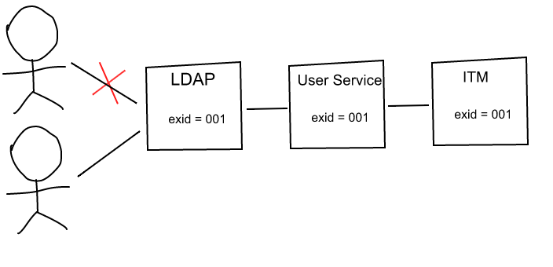

# Terminology

Term				| Description
------------		| -------------
Source data			| The raw data to add ITM bar. It needs to be transformed into ITM entry recognized by ITM.
Source application	| The application holds the source data, e.g. Connections.
Host application	| The application who has an ITM bar embeds ITM client. e.g. OrientMe, Verse, Mobile app.
ITM entry			| The entry that can be added into ITM bar or removed from the bar. From UI, usually it can also be referenced as bubble or circle.
ITM bar				| The bar that includes multiple ITM entries(bubbles, or circles).
ITM client			| The client that talks to ITM service by using REST API in JSON format to manage ITM entries. e.g. ITM Web UI, Mobile app.
ITM web client		| A special type of ITM client, a web UI component that can be embedded into host application run in web browser such as OrientMe.
ITM service			| The micro service used to handle requests sent from ITM client and maintain the ITM data.

# Concept Model

Figure: Concept Model
<!--
[Source Application]generate-.->[Source Data]
[Host Application]embed->[ITM Client]
[ITM Client]-[note: e.g. Mobile app{bg:cornsilk}]
[ITM Client]^-[ITM Web UI]
[ITM Client]has->[ITM Bar]
[ITM Bar]<>-entries*>[ITM Entry]
[Source Data]transform->[ITM Entry]
[ITM Client]call->[ITM Service]
[ITM Service]manage->[ITM Entry]
-->

# Assumptions, Constraints, Principles

* System boundary
    * It is not ITM but common components that provide
        * Type ahead
        * Service for people and communities search
    * It is not ITM but host application that defines
        * What should be happened after click an ITM entry?
        * When to display the red dot(i.e. hightlight) or water mark?
        * What actions are avaible to an ITM entry?
        * What should be happened after click an action on an ITM entry?
* Data volumn
    * Usually each user may not have so much entries, less than 100 for example.
    * Search by entry name makes much more sense when there are large amount of entries per user.
* Eventual consistency
    * ITM will sync data stored in ITM in lazy mode when it is stale.
* Extensible capability as common service
    * ITM will not only support OrientMe, but Mobile app and 3rd parties. Current interested parties:
        * Orient Me (via UI)
        * Mobile client (via API)
        * Action Center (via UI or API?)
        * Electron client (via UI or API?)
        * Verse (probably via API)
    * ITM will not only support people and communities, but other types of source data, even from 3rd parties.
* Loose coupling as common service
    * ITM should know less about host application and source application as much as possible.
* Keep it simple and stupid
    * Start with simple design
    * No over-design
    * Make trade-off with pros. and cons.

# Data Model (Concept)

    profiles {
        id (string, required),
        orgId (string, optional),
        entries [{
            id (string, required),
            name (string, required),
            lname (string, optional),
            type (number, required),
            image {
                url (string, optional),
                alt (string, optional)
            },
            score (number, optional),
            metadata (map, optional),
            added (date, optional),
            modified (date, optional),
            tags (array[string], optional) 
        }]
    }

Notes:
* `id`, the identity of the user who owns the entry, required to be unique and immutable.
* `orgId`, the identify of the organization for the owner, not required in Connections Blue. We may need this in query when we want to get all data in an organization. (e.g. organization content transfer)
* `entries`, represents a list of ITM entries.
    * `id`, the identity of the source data for the entry, required to be unique and immutable.
    * `name`, used as the display name of the entry.
    * `lname`, the lower case of the name.
    * `type`, used to indicate the type of the entry, e.g. 'people', 'community', 'customizedType', etc. The methods required to support data model 'type' need to be abstracted. In this way it would be easier to add additional types in future (or even switch the implementation for a given type).
    * `image`, used as the image of the entry. The most important attribute is url, others can be extended as needed. The default value for url will be used if not given.
    * `score`, a number used to sort the owner's entries. It can be set by ITM service or external application such as search service for cognitive ranking.
    * `metadata`, a key value pair list for the entry used for ITM client or host application to extend its capability. e.g. metadata.exId, the user external Id only used for people entry to compatible with Connections Green/Blue. The host application may need exId to filer its content view.
    * `added`, system generated timestamp used to indicate when the entry was added.
    * `modified`, system generated timestamp used to indicate when the entry was modified. Useful when we need to return on the updated entries. (304 vs. the whole data)
    * `tags`, an array of tags for the entry used for ITM client or host application to better describe the entry and extend its capability.

# Data Schema (Mongo)

    Database name: 'ITM'
    Collection name: 'profiles'

    ITM.profiles{
        _id (string, required),
        orgId (string, required?),
        added (date, optional),
        modified (date, optional),
        entries[{
            id (string, required),
            name (string, required),
            lname (string, optional),
            type (number, required),
            image {(object, optional)
                url (string, optional), 
                alt (string, optional)
            },
            score (number, optional),
            metadata{(object, optional)
                exId (string, optional)
            },
            added (date, optional),
            modified (date, optional)
        }]
    }

Notes:
* `required`, valve of the field must be provided by ITM Client
* `optional`, value of the filed is optional provided by ITM Client

Fields description:
* `_id`, the identity of the user who owns the entry, required to be unique and immutable. it is the document _id and part of the sharding key.      
* `orgId`, the identify of the organization for the owner, not required in Connections Blue. We may need this in query when we want to get all data in an organization. (e.g. organization data transfer). It's recommanded to add for future extension, and it's part fo the sharding key in Cloud.
* `added`, the creation time of the document
* `modified`, the last modified timestamp of the document, track any change of the document
* `entries`, an array of ITM entries, each entry is a bubble on ITM bar
* `entries.id`, the identity of the source data for the entry, required to be unique and immutable, must be unique in the same entries array
* `entries.name`, used as the display name of the entry
* `entries.lname`, lower case of entries.name
* `entries.type`, predefined type of the entry, like (1): 'people', (2): 'community'
* `entries.image`, used as the image of the entry, contains metadata of image
* `entries.image.url`, the most important attribute of the image, The default value for url will be used if not given.
* `entries.image.alt`, it can be used to extended if there is no url value given
* `entries.score`, a number used to sort the owner's entries (the position in the ITM bar). It can be set by ITM service or external application such as search service for cognitive ranking
* `entries.added`, system generated timestamp used to indicate when the entry was added.
* `entries.modified`, system generated timestamp used to indicate when the entry was modified. Useful when we need to return on the updated entries. (304 vs. the whole data)
* `entries.metadata`, an object has extended field in the future to indicate any special data of ITM Client
* `entries.metadata.exId`, for people, require external id to be saved, while for community, it has no meaning.

Not required fileds:
* `entries.status`, (0): invalid, the source of entry is removed, or have no permission, (1): valid, default
* `entries.orgId`, (string, not required), it is not required in current release, can be added in the future
* `entries.url`, (string, not required), it is not required in current release, can be added in the future
* `entries.tags`, (array[string], not required), it is not required in current release, can be added in the future, it is as metadata of the entry used for ITM client or host application to better describe the entry and extend its capability.

# Service API Specification

## Add an Entry

    POST /itm/api/entries
    {
        "id": "146137b4-7a7c-4134-8d71-bcb33d14be3c",
        "name": "Samantha Daryn",
        "image": {
            url: "/contacts/profiles/photo/20000731"
        },
        "type": "people",
        "metadata": {
          "exId": "20000731"
        },
        "tags": ["registeredUser"]
    }

Notes:
* The user Id and orgId are not needed as they can be resolved by ITM service after user login

## Get a List of Entries

    GET /itm/api/entries?limit=5&skip=1&type=people&tag=abc

Notes:
* Parameter limit and skip are used to support pagination.
* Parameter type is used as a filter to return a subset of entries with specified types. Can be multiple values.
* Parameter tag is used as a filter to qualify the returned results by entry metadata. Can be multiple values.

## Delete an Entry

    DELETE /itm/api/entry/{entryId}

## Move Entry

    PUT /itm/api/entry/{sourceEntryId}?target={targetEntryId}

Notes:
* This moves the source entry to the position immediate after the target entry.
* Use a special targetEntryId, e.g. 0, to move the source entry to the position before the first entry in ITM bar.

## Update Entries

    // Update communities name in batch
    PUT /itm/api/entries
    {
        entries: [
            {
                "id": "b6dab276-7a7c-4e72-80d4-bcb33d14be3c",
                "name": "New name of community1"
            },
            {
                "id": "146137b4-893e-4134-8d71-2329b4369871",
                "name": "New name of community2"
            }
        ]
    }

# User Identification

## Background

* Need user identity that is
    * Unique
    * Immutable

## Problems

* Violation in Connections Blue/Green if use [orgId, exId, other user attributes e.g. email] as user identity
    * Green, exId of revoked user can be reused for new user, violate unique rule
    * Blue, switch to new LDAP when WPI configured to be off, violate immutable rule
    * Blue, switch to new LDAP for beta user upgraded to formal use, violate immutable rule
    * Blue/Green, user changes email for some reason, violate immutable rule

Figure: Non-unique User Id

Figure: Mutable User Id

## Solution

* For Pink, we rely on People Service to provide user identity that is unique and immutable
* For Blue/Green, we rely on Profiles internal user id (PROF__KEY) that is unique and immutable.
* Get user identify each time without querying Profiles by encoding it into JWT token.
* Pros. 
    * Always point to the same user without worrying user attributes change
    * Consistent model for Pink and Blue/Green
    * Simple to implement
* Cons.
    * Not support WPI off.

## Solutions Discussed

* Composite user identity, e.g. (orgId, exId, email)
    * Complicated as user attributes change need to be synchronized
* Separate user table
    * Inconsistent model for Pink vs. Blue/Green
    * Complicated as user attributes change need to be synchronized
* Dedicated sync tool/mechanism
    * Similar to TDI for Blue, BSS event handling for Green.
    * As supplementary for other solutions to synchronize user data, still complicated.

# Data Validation

## Background

* When to validate?
    * Validate user who sends request to ITM service is registered in system.
    * Validate the ITM entry being posted to ITM service is valid.
        * People registered in system
        * Community exists in system.
* What's the value?
    * More value for security reason.
    * Less value for trusted ITM clients we have full control.
    * Less value for some ordinary data such as bookmarked internet links.

## Problems

* Limited knowledge on source application
    * For Communities, we know how to call REST API to check its existence.
    * For other source applications outside Connections, we even don’t know how to validate.
* Cost to integrate with source application
    * How to resolve authentication challenge when call external source application.
    * Even for known source application, Connections Blue/Green, we still need SSO solution.
* Tightly coupled with source application
    * ITM needs to know service endpoint and data structure for source application.
    * ITM performance depends on reliability and availability of source application.

## Solution

* Validate request sender for all requests
    * For Pink, call People Service
    * For Blue/Green, call WPI
    * Call to People Service/WPI is inevitable as we need user identity.
    * Call People Service/WPI in each request.
        * Maybe Okey as we are doing it in that way in Blue/Green
        * Optimization options: JWT, cache mechanism
* Do not validate source data for post request
    * Invalid data limited to individual, no impact to others

## Solutions Discussed

* Validate source data for post request, but limited the scope:
    * Validate data existence only
    * Validate data from known source application only
    * Validate data for source application who asks

# Data Synchronization

## Background

* Why data synchronization?
    * Source data is changed
        * Image updated or broken
        * Name changed
    * Source data is invalid:
        * People left the organization
        * Community is deleted
        * People lost access to community
* When to synchronize data?
    * For data change, update proactively when user login
    * For data invalid, prompt when user perform actions on the ITM entry

## Solution

### Image Update

* ITM client decides when to get image.
    * Make calls to source application in parallel to get images for all visible ITM entries on current page after user login.
    * Do not make another call until bar scrolled, page refreshed, or user logged in again.
    * Make individual call for the ITM entry when user performs action on it. (optional).
* ITM client decides how to render image.
    * Render default image if image URL is broken because:
        * Source data invalid
        * Source application unavailable
* For ITM clients other than ITM web client, e.g. Mobile app or 3rd parties, they can decide by themselves.
* Pros:
    * ITM client has flexibility to use different strategy to make image call. (e.g. Mobile app may have its own cache and more lazy.)
    * ITM client does not rely on source application when image URL is broken.
* Cons:
    * Add cost to ITM client.
    * Multiple requests, one for each image.

Figure: Display Entry Image
<!--
title Display Entry Image

User->Host Application: login, refresh page
Host Application->ITM Web Client: renderBar()
ITM Web Client->+ITM Service: getEntriesForCurrentUser()
ITM Service--&gt;-ITM Web Client: [entry1, entry2]
ITM Web Client->ITM Web Client: renderEntry(entry1)
ITM Web Client->+Source Application: get image for entry1
ITM Web Client->ITM Web Client: renderEntry(entry2)
ITM Web Client->+Source Application: get image for entry2
Source Application--&gt;-ITM Web Client: HTTP 200
ITM Web Client->ITM Web Client: doRender(entry2)
Source Application--&gt;ITM Web Client: HTTP 404, HTTP 500
ITM Web Client->ITM Web Client: doRenderDefault(entry1)
-->

### Name Change

* Source application sends event over to ITM via Pub-Sub infrastructure.
* ITM stores data change into its internal cache.
* When the ITM bar is accessed, if some defined time period has elapsed since the last time we visit the bar, we will read the individual entries from the internal cache.
* Pros.
    * Update is just happened when source data is changed. 
    * ITM service does not need to know much about source application.
* Cons.
    * Add complexity to overall architecture.
    * Complex data schema.
    * Require code change in source application or cost to build mediator.

Figure: Update Item Name
<!--
title Update Item Name

User->Host Application: Login, refresh page
Host Application->ITM Web Client: renderBar()
ITM Web Client->+ITM Service: getEntriesByUser()
ITM Service->-ITM Web Client: [entry1, entry2, entry3]
ITM Service->+Cache: getEntryFromCache(entry2):expired=true
Cache->-ITM Service: [entry2']
ITM Service->+ITM Service: upateEntry(entry2')
-->

#### Solutions Discussed

* Follow the same pattern used by image update.
    * Make calls to source application in parallel to get source data for all visible ITM entries on current page after user login.
    * Extract the name, and other necessary attributes (e.g. exId if it is a people entry) from source data.
    * Call ITM service to update stale ITM entries in batch.
    * Name synchronization needs to be controlled by gatekeeper.
* Pros:
    * Consistent model for image update and name change
    * Consistent model for Pink and Green/Blue.
    * Simplify ITM service and data schema (single table). 
* Cons:
    * Add cost to ITM client.
    * Double requests, two requests for one ITM entry. One for image, one for source data.
        * To use bulk call for multiple people or communities sync may not help a lot to relief the workload on Connections side. (The thundering herd issue - X'0000 users login at 9:00 am in the morning)
        * Scatter the calls in bigger time range.
        * Only sync when user clicks the entry.
    * ITM client needs to know service endpoint and data structure for source application.

* Pull mode, ITM service proactively pulls data from source application.
    * Pros.
        * Simplify ITM client and data schema.
        * Do not require code change in source application.
    * Cons.
        * ITM service needs to know service endpoint and data structure for source application.
        * ITM service needs to call source application directly under SSO, sometimes difficult for 3rd parties.
        * Cost of computation resources and network traffic when source data not changed.

* Push mode, source application or mediator listens to the update then notify ITM. (Event pub/sub)
    * Pros.
        * ITM service does not need to know much about source application.
        * Minimize cost of computation resources and network traffic as update is just happened when source data is changed.
    * Cons.
        * Add complexity to overall architecture.
        * Complex data schema.
        * Different implementation in Pink and Green/Blue as no Kafka in Blue.
        * Require code change in source application or cost to build mediator.
        * May have to update all users who add this entry. (May be inefficient if we do not store entryOrgId.)

## Data Invalid

* Rely on host application to detect data validity.
* ITM web client exposes way for host application to add removal action for user to remove the invalid ITM entry.
* ITM client sends update request to ITM service to mark entry invalid.

Example:

    // Mark entry invalid
    PUT /itm/services/entries
    {
        entries: [
            {
                "id": "b6dab276-7a7c-4e72-80d4-bcb33d14be3c",
                "status": "0" // invalid
            }
        ]
    }

# Item Filtering

## Background

* ITM deployed in central place serving multiple host applications. e.g. consumed by both OrientMe, Mobile app and Verse.
* The same ITM entry set may need to be filtered when displayed in different host applications.

## Solution

* Each ITM entry may have tags attached when added into ITM bar.
* Each host application can define filter for entries to be displayed in its ITM bar.
* All ITM entries will be returned and displayed if there’s no filter defined.
* It is the host application rather than ITM know:
    * Which tags should be attached when add entry.
    * Which entries should be returned when retrieve entries.
* Example:
    * People added to ITM in Verse, set type to 'people'
    * People not registered on cloud added to ITM in Verse, set type to 'people' and add tags: ['unregisteredUser']
    * Community added to ITM in OrientMe, set type to 'community'
    * In OrientMe, filter will be: type in ['people', 'community'] && tag not in ['unregisteredUser']
    * In Verse, filter will be: type in ['people']

Figure: Filter Entries by Tags
<!--
title Filter ITM entries by Tags

User->OrientMe: Add people registered on cloud
OrientMe->ITM: Add people with type = "people", tags = ["unregisteredUser"]
User->OrientMe: Add community
OrientMe->ITM: Add community with type = "community"
User->Verse: Add people unregistered on cloud
Verse->ITM: Add people with type = "people", tags = ["unregisteredUser"]
User->OrientMe: Get ITM bar
OrientMe->ITM: Get ITM entries by type in ["people", "community"] && not in ["unregisteredUser"]
User->Verse: Get ITM bar
Verse->ITM: Get ITM entries by type in ["people"]
-->

# Item Reordering

## Background

* User can change display order of ITM entry in ITM bar manually.
* ITM bar can render ITM entries smartly based on ranking score calculated by external cognitive service.

## Solution

* Use dispersed value as display order in initial.
* Update score when user manually reorder ITM entries.
* Update score by external cognitive service via ITM service.

Figure: Original Item List and Scores

    | entry1 | 10000 |
    | entry2 | 20000 |
    | entry3 | 30000 |
    | entry4 | 40000 |
    | entry5 | 50000 |

* To move entry3 and put it after entry1, we change entry3 score to be (10000 + 20000) / 2 = 15000.
* No need to update scores for other entries.
* When the gap of scores for two adjacent entries is collapsed, a complete score calculation for all entries is needed.

Figure: New Item List and Scores

    | entry1 | 10000 |
    | entry3 | 15000 |
    | entry2 | 20000 |
    | entry4 | 40000 |
    | entry5 | 50000 |

# Event Auditing

## Solution

* For Pink, we will introduce event pub/sub mechanism such as Kafka serving auditing for all micro services.
* For Blue, we do not support event auditing for ITM in current release.
    * Additional cost.
    * Only ITM will contribute to event auditing now.
    * Customer needs to learn new way to audit events instead of SPI

# Group of People

## Backgroud

* User can define a group as an ITM entry to add multiple people into it.
* When click the entry, it may combine the content from all individuals together in a single view

## Solution

* This will not be the part in ITM first release. UX Design has not been finalized yet.
* We will have the flexibilty to accomodate it in later releases, as we use Mongo which is schema free.

# Typahead entries by Name

## Solution

* Typeahead in client.
    * Pros.
        * Most efficient as no network traffic.
        * Acceptable as each user may has not many entries.
    * Cons.
        * Add client cost. ITM clients built their own UI will have to implement it by themselves.
* Typeahead in memory at server-side.
    * Pros.
        * No additional client cost.
        * Efficient as no frequent DB queries when user types ahead.
    * Cons.
        * Still have network traffic.
* Typeahead in Mongo and search entries by the prefix of entry names.
    * Pros.
        * No additional client cost.
        * More efficient than use terms in middle or in the end, or regex.
    * Cons.
        * Still have network traffic.
        * Potential performance impact. (Need test)

# Cognitive Integration

## Background

* Allow coginitive service to modify entry score for ranking purpose
* Allow coginitive service to provide sugguested entries along with the entries added by user.

## Solution

* Ranking score
    * Cognitive service listens to the events created by ITM service.
    * Cognitive service calculates entry score based on these events.
    * Cognitive service sends request to ITM service to store the entry score into ITM.
* Suggested entries
    * Cognitive service listens to the events created by ITM service.
    * Cognitive service provides suggested entries based on these events.

# Verse Integration

## Background

* Verse builds its ITM web UI on Dojo.
* Verse uses ad-hoc API built on Domino nsf.
* Users expect that people they add to the ITM bar will show up in their Verse ITM bar as well as in Orient Me.
* It is not preferable to maintain two ITM implementations at the same time.

## Problems

* It is hard to have React co-work with Dojo.
* Domino based ad-hoc API may not be a good choice for RESTful client. (Do they have Mobile app only talking to REST API?)

## Solution

* Migrate data from Verse to ITM.
* Replace the client with ITM web client.
* Modify Verse client to call ITM service.
* Data synchronization between Verse and ITM in background
    * Pros.
        * Without change both Verse client and API.
    * Cons.
        * Possible UI inconsistency.
        * It may take time to finish the synchronization.

# What’s Left

* UI interaction with host application

<!--
# Integrate with Common Type Ahead (ITM Web UI Only)

* Register type ahead into ITM bar
* Ability to set data store for type ahead
* Ability to translate user selected entry into data known by ITM. (Data mapping from source application to ITM)
* Basic flow
    * Create instance of ITM bar
    * Set data store for type ahead
    * Set handler for user selected entry
    * Call ITM service API within handler to post user selected entry to ITM. (Data mapping needed)
    * Render ITM bar to reflect the change after entry added
-->

# User Stories as Reference

The following stories are extracted from UX deck that cover all requirements described in the deck. They are used to deduce the ITM design. The short name at the end of each story is simply a convenient shorthand. Stories that are checked means they have been covered in the design, others are not covered yet.

* [x] As a user, I want to add people or community into ITM bar. (**Add people or community**)
* [ ] As a user, I want to add a group of people into ITM bar as a single entry. (**Add group**)
* [x] As a user, I want to add not just people or community but also other types of entries into ITM bar. (**Add others**)
* [x] As a user, I want to change display order for the entries in ITM bar. (**Reorder entry**)
* [x] As a user, I want to delete entry from ITM bar as needed. (**Delete entry**)
* [x] As a user, I want to filter the entries that are meaningful to my current application. (**Filter entries**)

* [ ] As a user, I want to see host application showing content specific to the ITM entry I select. (**Filter content by entry**)
* [ ] As a user, I want to see a dot appear on the ITM entry when there are new updates. (**Updates indicator**)
* [ ] As a user, I want to see available actions showing on the ITM entry based on condition such as user entitlement. (**Display actions**)
* [ ] As a user, I want to see different react as needed after I perform an action on the ITM entry. (**Click on action**)
* [ ] As a user, I want to scroll ITM bar in web UI so that I can see the invisible entries in current viewport. (**Scroll bar**)

* [x] As a user, I want to see the name of ITM entry get updated when the data from source application is renamed. (**Item rename**)
* [x] As a user, I want to see the image of ITM entry get updated when the image of the data from source application is changed. (**Item image changed**)
* [x] As a user, I want to see warning message displayed in host application if ITM entry is no longer valid from source application. (**Item invalid**)
* [ ] As a user, I want to see the removal button on ITM entry when user selects the entry and finds it is no longer valid. (**Remove invalid entry**)
* [x] As a user, I want to see an icon for the ITM entry even it is invalid in source application. (**Show icon for invalid entry**)