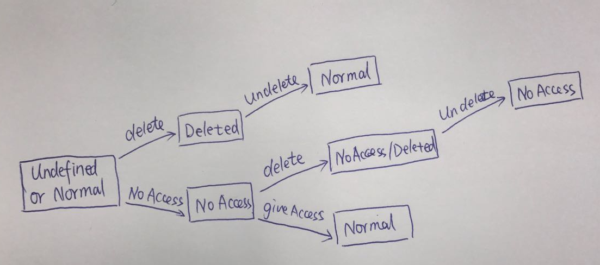
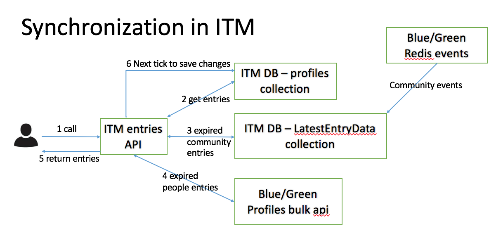
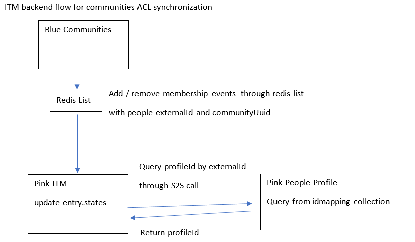
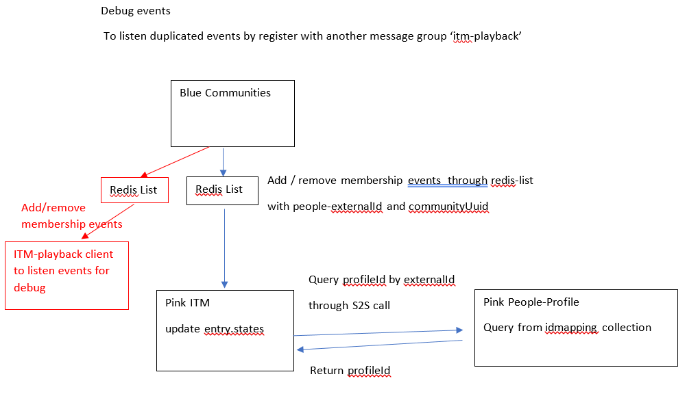

# Data Synchronization

Things to keep in mind before we design:

* More reads than writes
* Eventual consistency
* Keep it simple and stupid

### What to store?

#### The data model

The data model for ITM data synchronization table may look as below:

    id (string, required),
    name (string, required),
    metadata{(object, optional)
      exId (string, optional)
      email (string, optional)
    },
    modified (date, required),
    state? (string, optional),
    ref? (number, required)

Note:

* Generally, this is a sub set of entry data model defined in `profiles` table.
* Currently, the major purpose for ITM data sync is to sync data change on user or community name, user external ID, user email.

### When to store?

#### Reference counting

When ITM recieved events via pub/sub channel, it can choose whether to save the events or not by reference counting model.

* When an entry is added into ITM, create the corresponding entry in data sync table and increase the reference counter. If the entry is existed because it was added by others previously, just update the entry to increase the reference counter.
* When an entry is deleted from ITM, update the corresponding entry in data sync table and decrease the reference counter. If it decreased to zero, then remove it from the table.
* When ITM recieved events via pub/sub channel, it only saves the event if the corresponding entry can be found in the data sync table.

#### Pros and Cons

The major benefit for this approach is that we can eliminate unnecessary event handling and data storage for people/communities that are not being referenced by anyone in ITM.

The drawbacks may include:

* Performance impact. Each time when add or remove entries, there will be additoinal db access to the data sync table, either create entries, or update reference counter. But this may be acceptable because:
  * It was assumed that ITM usage model will be `more reads than writes`.
  * The additional db access to data sync table can be put into the next tick of Node event loop, so that will not make the current user request to be slow.
* Incorrect reference counter. The reference counter could be incorrect for whatever reason. When that's happened, either there will be additional costs for unnecessary event handling and data storage, or the data should have been synchronized will be missed. But this may be acceptable because:
  * It was assumed that those wrong data will not be too much, so that will not be too much costs on CPU cycles and data storage.
  * The missed synchronized data will be back as long as more people reference them. This could be fine as we do not seek immediate consistency, but eventual consistency.

Alternatively, a much simpler reference model is not to count but just add reference: only add reference for entry from `profiles` table to the data sync table, and never remove it. This makes the code much less possible to encounter error, while the drawback is to leave the dangling entries in data sync table for ever without cleanup.

### Do we sync data invalid?

Probably yes, we could do it partially. But prefer no because of complexity, and this can alternatively delegate to host application.

#### When is data invalid?

* People removed(suspend, make inactive, etc.)
* Community deleted
* People removed from community
* Community visibility change from public to private

#### How to reflect data validity?

* We need `state` to reflect the data validity. The default value for `state` is `NORMAL`.
* When people is removed or community is deleted, it becomes `DELETED`. This is done by event handler to update the data sync table.
* When people is unremoved or community is undeleted, it turns back to `NORMAL`.
* When people is removed from community, we directly look up `profiles` table to check if the people being removed added the community into his ITM bar. If yes, mark `state` as `NOACCESS`
* When people is added back to community, we look up `profiles` table again and change `state` back to `NORMAL`.
* For data change, we may mark `state` as `UPDATED`.

#### How to deal with visibility change to private?

* No easy way.

#### Why delegate to host application?

* The host application will always hit the data validity issue, otherwise no one will care the data invalid in ITM. e.g. When end user clicks ITM entry in OrientMe to access a community which has been changed from public to private, OrientMe may get access denied because the user is not an explicit member of this community. Otherwise, the end user may even not be able to notice the community has already been invalid.
* We simply allow host application to set the `state` via PUT request (update entry), so that will be persisted for ITM to mark it as invalid when page refreshed or user login next time.

### When to sync?

We probably could support data sync for GET /entries, but perfer only to GET /entries/:id because of complexity. The drawback is client needs additional call to gain the benefit of auto data sync.

#### GET /entries/:id

* Use TTL: query data sync table when time is expired since last sync. (field `modified`) If `modified` not changed, no sync needed.
* Use next tick: query data sync table in next tick, so that client will get the synced data in next GET /entries/:id. (Eventual consistency)

#### GET /entries

* It is not very intuitive for consumer to make an additional call on GET /entries/:id in order to get synced data.
* It is reasonable for consumer such as mobile to have a lazy strategy to get all synced data in one go.
* The major concern is performance. Essentially we need an efficient & simple way to know, given a set of entries, how many entries really need to be synced (by checking `modified`). If no entry needs to be synced, we should return immediately. If we cannot do this efficiently and simply, we should never do it.
  * To design Mongo collection smartly?
  * To use in memory cache e.g. Redis with sorted set?
  
#### Entry state flow
* Add a new property states which is an array of string to indicate the state of the entry
* Its value is undefined or null by default, which means normal state
* If it is deleted status, there is no membership operation



#### Synchronization work flow


#### ACL synchronization flow for Community Entry
* membership change event carries profile externalId and cummunityUuid
* ITM need using S2S call got get profile internalId (profileId) from People-Profile (the idmapping is imported by migration tool)
* ITM sync the ACL state into profile.entry.states directly



#### To debug events from Blue/Green

In order to debug events from Blue/Green, we can register with another message group to listen events from Blue/Green

* change the src\utils\constant-def.js

```
  CONNECTIONS_EVENTS_SUBSCRIPTIONS_REG_NAME: 'itm',
  CONNECTIONS_EVENTS_SUBSCRIPTION_LIST: 'connections.events.itm',

--->

  CONNECTIONS_EVENTS_SUBSCRIPTIONS_REG_NAME: 'itm-playback',
  CONNECTIONS_EVENTS_SUBSCRIPTION_LIST: 'connections.events.itm-playback',

```

* set system ENV variables to point to redis, for example as below:

```
export REDIS_AUTH_ENABLED=true
export redis_secret=test             --- password of redis
export redis_host=9.110.183.52       --- hostname/ip of redis
export redis_port=6379               --- port number which can be accessed outside

```

* run "npm run start:dev --db=memory", then this new node JVM can listen duplicated events from Blue/Green, as blow picture:



### SmartCloud Support
SmartCloud support cluster deployment, and sharding-keys must be defined.

#### Community Entry synchronization in SC (Green, Pink)
Currently, reference data of community entry is stored into latestentrydata collection, and
no orgId defined. In order to support SC, below questions are required to be answered:
* If orgId is required to be added into latestentrydata?
In GREEN, data should be deployed into sharded cluster, but the deployment must be together with old 
Connections (play together with communities), which is based on DB2 without Data-Center partitioning (data can be deployed into different location according to organization), hence there must be also no Data-Center partitioning requirement for ITM, all data are located in the same location, latestentrydata can be sharded by 'id' only, orgId is no required as part of sharding-keys. Content in latestentrydata are temporary, can be cleaned, and will be rebuilt automatically, so if there is a more detail requirement to required to add orgId, which can be added based on future requirement, and there is no big risk here.
* If logical is required to added to support org-transfer, org-cross sharing and visitor-model?
In GREEN, since there is no orgId in latestentrydata collection, and already support org-transfer, org-cross sharing and visitor-model. But if in future, in pure Pink area, orgId is required to added into latestentrydata, the logical and design can be done in the future when the requirement is clear based on clear required background, and there should be no much risk. BTW, In pure Pink, will communities still co-exist?
